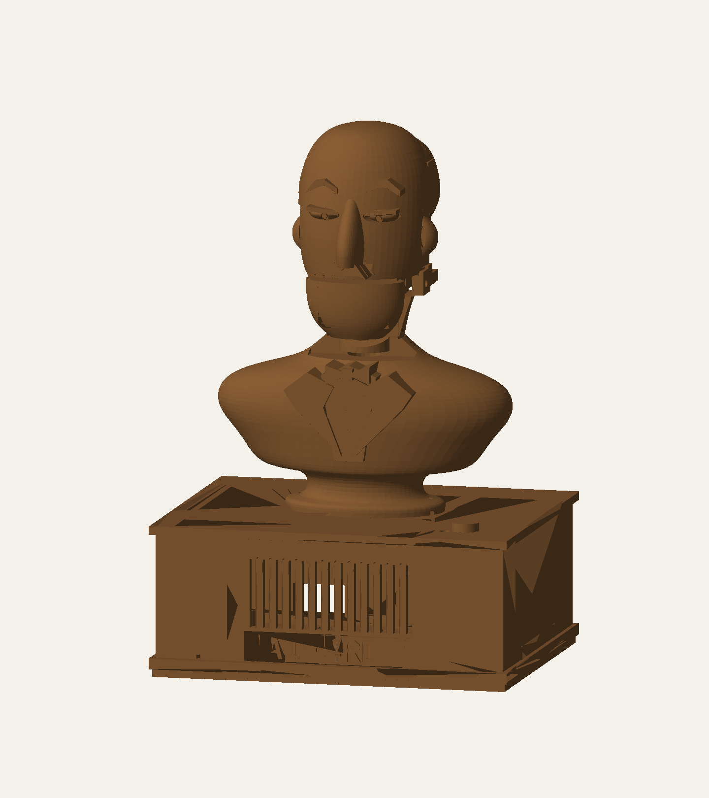
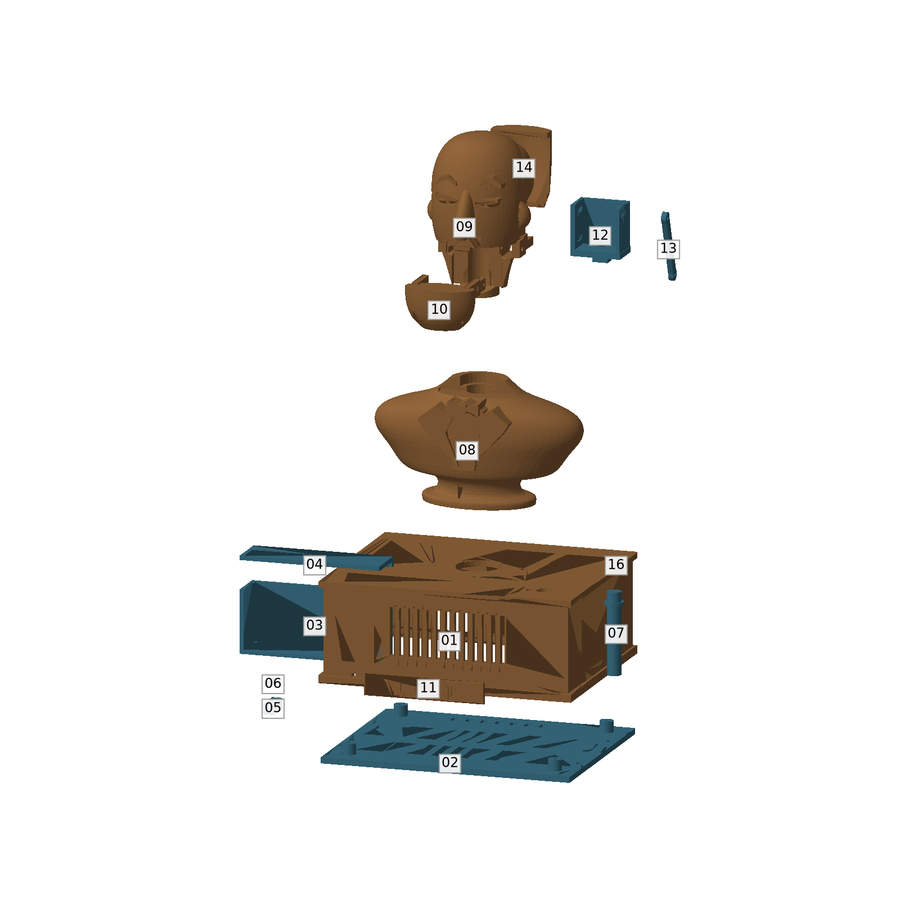

# A1-4RD — "Alfred"

[](https://github.com/mkol-ME/A1-4RD/actions/workflows/tests.yml)
[](LICENSE)

A 3D-printed desk companion with a moving jaw and a voice, written in the manner of an old-fashioned
butler: dry, warm, terse, and genuinely useful. Not a smart speaker.

Everything runs locally. A laptop (later a Raspberry Pi inside the printed body) is the face: microphone,
speaker, wake word. A headless Ubuntu box on the LAN is the brain: speech recognition, memory, web lookup,
the language model and his voice. Nothing is sent to a hosted service.

> **The character is the project. Everything else is plumbing.**

## What I built, and what I learned

I built a voice assistant with a fixed personality that runs entirely on my own hardware: speech detection
and wake word on a laptop, and Whisper, a 26-billion-parameter language model, long-term memory, web and
weather lookup and a custom synthesized voice on a home server. That server runs on a secondhand datacenter
GPU I had to reflash and coax into a consumer motherboard. Through measurement rather than guesswork, I got
a spoken reply's first sound down to about 1.15 seconds, and a web-searched answer from 7.1 to 3.5 seconds.
The biggest lesson was that intuition is unreliable with language models. Adding rules to the prompt made
the character worse three separate times. My first test suite passed while the real failures went
undetected, because its questions had leaked into the training examples. Two confident theories about why
he rambled both turned out wrong. So I built a held-out evaluation that checks its own contamination, and
changed things only when a number moved. I also learned to put boundaries in code rather than instructions:
anything that reaches the prompt will eventually be said out loud, so access to memory has to be enforced in
the database query itself.

## The physical build

The body is fully modelled in CAD; it has not been printed or assembled yet.

<p align="center">
  
  
</p>

- **Printed body** ([`hardware/cad/mechanical/rev-b`](hardware/cad/mechanical/rev-b)): sixteen parts as STEP
  solids and millimetre STL, 202 mm tall. The chin is a separate part, driven by a servo through a drive
  link, so the jaw can move while he speaks.
- **Electronics layout** ([`hardware/cad/mechanical/modules-rev-a`](hardware/cad/mechanical/modules-rev-a)):
  a tray and fit models for off-the-shelf boards — Raspberry Pi, I²S microphone, amplifier, servo driver and
  USB-C power.
- **Custom carrier PCB** ([`hardware/cad/pcb/rev-e`](hardware/cad/pcb/rev-e)): a four-layer KiCad board for a
  Pi Zero 2 W, an ICS-43434 microphone, a MAX98357A amplifier and the jaw servo, with a latching power-fault
  cutoff. Gerbers, drill files, BOM and DRC/ERC reports are included; revisions C to E are kept. Not yet
  fabricated.

The STEP files open in SolidWorks, Fusion or FreeCAD. [`hardware/cad/README.md`](hardware/cad/README.md) maps
every revision.

---

## Contents

- [The physical build](#the-physical-build)
- [How a spoken turn works](#how-a-spoken-turn-works)
- [Hardware](#hardware)
- [Repository layout](#repository-layout)
- [Talking to Alfred](#talking-to-alfred)
- [The server](#the-server)
- [Performance](#performance)
- [Testing](#testing)
- [Status and roadmap](#status-and-roadmap)
- [Further reading](#further-reading)

---

## How a spoken turn works

```text
 LAPTOP (client/)                               SERVER (brain/, over an SSH tunnel)
 ─────────────────                              ───────────────────────────────────────────────
 microphone, 16 kHz
   → speech detection against the room's
     measured noise floor
   → at 0.20 s of silence, send audio ────────→ Whisper small.en on the GTX 1060
   → at 0.40 s, end the turn — or wait up to
     1.0 s if the words so far trail off
   → wake word / attention window
   → text ────────────────────────────────────→ voice server
                                                  → tool gate: does this need a lookup?
                                                  → decider: search memory / search web
                                                    (SearXNG, Wikipedia) / sports scores
                                                    (ESPN) / news (Google News) / remember
                                                    weather goes to Open-Meteo instead
                                                  → gemma4 26B on the MI50 via Ollama
                                                  → cut the stream into whole sentences
                                                  → Alfred's distilled Piper voice (CPU)
 speaker (WASAPI) ←──── one WAV per sentence ─── ← streamed as NDJSON
```

The pieces are deliberately separable:

| Layer | Files | Decides |
|---|---|---|
| **Character** | `persona/` (private; `.example` stand-ins here), `brain/prompts.py` | how he behaves |
| **Knowledge** | `brain/memory.py`, `brain/memory_tools.py`, `brain/web.py`, `brain/weather.py`, `brain/sports.py`, `brain/news.py`, `brain/markets.py` | what evidence he sees |
| **Transport** | `brain/voice_server.py`, `brain/whisper_server.py`, SSH | how text and audio move |
| **Embodiment** | `client/listen.py`, `client/talk.py`, later the servos | how he is present in the room |

A better voice cannot fix a bad answer, and a longer prompt cannot replace memory, so each layer is
debugged on its own.

---

## Hardware

**Server** (headless Ubuntu 24.04; setup and operation in [docs/server.md](docs/server.md))

| Part | Role |
|---|---|
| i7-8700 · 48 GB DDR4 · MSI MPG Z390 Gaming Plus | host |
| **AMD Radeon Instinct MI50 32 GB** | the language model (Ollama, Vulkan backend) |
| **NVIDIA GTX 1060 6 GB** | Whisper |
| 500 GB NVMe · 3×2 TB RAID 5 · 1.5 TB | OS and models · Alfred's memory database · spare |

The MI50 is a secondhand datacenter card. Getting it working in a consumer board took a VBIOS reflash,
*Above 4G Decoding* in the BIOS and `pci=realloc` on the kernel command line. It has no fan of its own, so a
server fan is driven from the card's temperature by [`ops/fan`](ops/fan). Two driver settings keep the whole
model in video memory; without them half of it silently spilled into system RAM, at 4 tokens a second
instead of 40 ([why each setting is there](docs/server.md#ollama-settings)).

**Client:** any Windows laptop with a microphone. Later: a Raspberry Pi in the printed body, with a servo jaw
and a neck servo — see [The physical build](#the-physical-build).

---

## Repository layout

```text
A1-4RD/
├── brain/                    runs on the server
│   ├── alfred.py             model choice, prompt assembly, streaming; also a terminal chat client
│   ├── memory.py             SQLite memory: recent conversation, facts, semantic search
│   ├── memory_tools.py       the tool decider and its tools (memory, web, facts)
│   ├── web.py                Wikipedia + SearXNG lookup, run concurrently
│   ├── sports.py             live scores, results and fixtures from ESPN
│   ├── news.py               headlines from Google News
│   ├── markets.py            live prediction-market odds from Polymarket
│   ├── machine.py            the server's own temperatures, fan, power, VRAM, RAID and disks
│   ├── weather.py            live forecast from Open-Meteo, not search snippets
│   ├── media.py              "play…" / "find videos of…" requests and spoken titles
│   ├── media_server.py       YouTube search, audio stream, chapters and captions (own venv: yt-dlp, PyAV)
│   ├── guru.py               The MMA Guru's take on a fight, from his breakdown videos
│   ├── voice_server.py       one spoken turn end to end, streamed sentence by sentence
│   ├── whisper_server.py     resident Whisper, so no model load per utterance
│   ├── audio_archive.py      every utterance kept on the array with its transcript, under a size cap
│   ├── youtube.py            what a named YouTube channel has posted, from its real upload list
│   ├── spoken.py             text rules for what is said aloud, such as which voice reads a sentence
│   ├── prompts.py            loads the private wording, or the .example stand-ins
│   └── whisper_transcribe.py one-off file transcription
├── persona/
│   ├── alfred.example.md     stand-in for alfred.md (who he is), which is kept private
│   ├── examples.example.md   stand-in for examples.md (how he talks)
│   └── prompts.example.json  stand-in for prompts.json (the instructions sent with each turn)
├── client/                   runs on the laptop
│   ├── listen.py             speak to him: wake word, attention window, early transcription
│   ├── talk.py               type to him, hear him answer; also the audio player
│   ├── music.py              plays YouTube audio; pause, stop, volume, ducking under his voice
│   └── launcher/             builds Alfred.exe, a double-click launcher
├── scripts/                  server launch scripts, and a scratch copy of the voice server for testing
├── voice-training/           how his voice was made: auditions, RVC, distillation into Piper
├── tests/                    unit tests for memory, tool gate and the listening loop
├── ops/                      server setup, version-controlled
│   ├── fan/                  MI50 fan curve service + interactive installer
│   ├── reboot/               idle-only 3 a.m. reboot every third night
│   ├── ollama/               Ollama settings and boot-time model preload
│   ├── services/             start SearXNG, Whisper and the voice server at boot
│   └── remote-access/        key-only SSH and Tailscale
├── requirements/             pinned environments (client TTS, Whisper, RVC, Qwen-TTS)
├── hardware/                 CAD (STEP/STL), KiCad PCB and bring-up notes for the body
└── docs/                     running the server, and reaching it
```

---

## Talking to Alfred

- Say **"Alfred, …"** to start. He then stays attentive for three minutes without needing his name.
  **"That'll be all"** dismisses him.
- Say his name while he is talking and he stops, so you can cut in.
- **"Play …"** asks whether you want Spotify or YouTube, then plays it through his speaker. **"Find videos
  of …"** reads out the top results. While music plays, **"Alfred, pause / resume / stop / louder / quieter"** works, and the
  music drops whenever he talks.
- Ask about the weather, last night's game, the news, or something you told him last week. He decides
  on his own when a question needs a lookup.
- Typing works too: the same conversation and memory, without the audio.

Running the client and the server is covered in [docs/server.md](docs/server.md).

---

## Performance

Measured 2026-09-16, from the end of speech to Alfred's first sound, with real audio through the whole
pipeline:

| Turn | Before the MI50 work | Now |
|---|---|---|
| Plain conversation ("why do my prints warp") | 1.5 s | **≈ 1.15 s** |
| Needs the tool decider ("what should I have for dinner") | 4.2 s | **≈ 1.6 s** |
| Memory lookup ("what did I tell you about…") | 4.5 s | **≈ 1.9 s** |
| Web search, real answer (holding line at ≈ 1.0 s) | 7.1 s | **≈ 3.5 s** |

**Model choice.** Candidates run on the MI50 with Alfred's real prompt:

| Model | First sentence | Speed | Character eval |
|---|---|---|---|
| **gemma4:26b Q8** (in use) | **0.43 s** | 41 tok/s | **75/78** |
| gemma4:31b | 1.61 s | 15 tok/s | 77/78 |
| qwen3.6:35b-a3b | 1.35 s | 54 tok/s | 75/78 |
| qwen3.8:27b | 5.50 s | 17 tok/s | — |
| qwen3.5:9b (previous) | 1.77 s | 63 tok/s | 67/78 |

The Qwen 3.x models re-read the whole persona on every turn; Gemma reuses the cached prefix, which is most of
the gap. `gemma4:31b` is the alternative if character ever matters more than speed — one line in
`brain/alfred.py`.

---

## Testing

The unit tests cover memory, the tool gate, the listening loop (segmentation, wake word, unfinished
sentences), the spoken-reply rules, the voice EQ and each lookup's parsing. They need no GPU or model, and
[run on every push](https://github.com/mkol-ME/A1-4RD/actions/workflows/tests.yml):

```bash
pip install numpy scipy sounddevice
python -m unittest discover -s tests
```

The character, conversation and routing evaluations are built on the private persona and real
conversations, so they are kept out of this repository along with it.

---

## Status and roadmap

**Done**
- The persona, and the full voice pipeline: ears, memory, lookups, voice
- MI50 bring-up and latency work; services that start at boot; remote access over Tailscale
- Live weather, sports, news and web search; spoken corrections
- Music from YouTube or Spotify, ducked under his voice; cutting in by saying his name
- A typed client sharing the same conversation and memory
- Optional tools loaded from outside the repository, which can report back when a long job finishes
- The printed body and the carrier PCB, designed in CAD

**Next**
- Recognising who is speaking, with separate memory per person (enforced in SQL, never in the prompt)
- Small character faults — through example curation, not more rules
- A bench prototype of the electronics ([plan](hardware/bringup-plan.md))

**Later:** the Raspberry Pi client inside the printed body, with the servo jaw and neck; timers and alarms
that still ring when the network is down.

---

## Further reading

- [docs/server.md](docs/server.md) — running the client and the server
- [docs/SSH.md](docs/SSH.md) — reaching the server
- [hardware/](hardware) — the physical build

## License

The code is released under the [MIT License](LICENSE). The Adafruit board files in
[`hardware/cad/mechanical/modules-rev-a/source/board-sources`](hardware/cad/mechanical/modules-rev-a/source/board-sources)
keep their own CC BY-SA licence.
