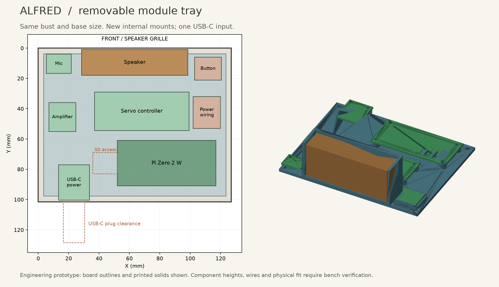

# Alfred — module prototype A

13 September 2026. A mechanical layout and fit-test package for the Pi Zero 2 W / local-server architecture. **Bench qualification remains required; this is not a tested appliance or a PCB fabrication release.**

## What changed

The finished bust exterior, overall size and existing jaw linkage are retained. The custom carrier PCB is replaced by an assembled microphone board, amplifier board, servo pulse controller and USB-C power-input board on a printed tray. A small hand-wired power distribution assembly and button perfboard are still required. Some header and wire soldering is unavoidable.

New or revised printed parts:

| File in CAD/ | Change |
|---|---|
| 01_Plinth_modules | Existing rear power opening extended left to X=15.5 and upward to Z=21.5. Front and overall envelope unchanged. |
| 03_Speaker_mount_modules | Adds a lead clearance notch behind the speaker. |
| 07_Button_stem_modules | Shortens the lower end to Z=22.1 for a switch actuator at Z=21.9. |
| 17_Electronics_tray | Uses the four existing base supports; separate board mounts and microphone acoustic extension. |
| 18_Switch_carrier | Supports a 17.78 x 15.24 x 1.6 mm piece of perfboard beneath the original button. |

Unchanged parts are included as STEP/STL. The original SolidWorks files are kept offline, unchanged; Revision B's STEP exports carry the same geometry. New parts are STEP solids, printable STL and regenerable Python/CadQuery geometry, **not native SolidWorks feature trees**. Import the assembly STEP into SolidWorks for inspection or further work. Reference envelopes are named separately and must not be printed as hardware.

## Selected electronics

| Qty | Item | Purpose / constraint |
|---:|---|---|
| 1 | Raspberry Pi Zero 2 W | Existing Python/SSH audio client. Use a header fitted on the component side. |
| 1 | Adafruit 6049, ICS-43434 breakout | Microphone; bottom acoustic port faces the printed duct. |
| 1 | Adafruit 3006, MAX98357A mono amplifier | Drives the enclosed speaker. |
| 1 | Adafruit 815, PCA9685 servo controller | Produces stable servo pulses independently of Linux scheduling. PCB Rev C source used for mounting. |
| 1 | Adafruit 5807, HUSB238 power breakout | One USB-C input, fixed **5 V / 3 A request**. See Wiring.md before connecting. |
| 1 | Raspberry Pi official 27 W USB-C supply, appropriate regional version | Previously selected supply; validate its actual 5 V contract and loaded output with the HUSB238. Do not infer 5 A operation from the supply label. |
| 1 | Adafruit 3351, enclosed 4-ohm 3 W speaker | Nominal body fits the existing cradle; verify actual lead exit and tabs. |
| 1 | FEETECH FS90 positional servo | Original jaw mechanism. FS90R continuous-rotation is unsuitable. |
| 1 | Omron B3F-1000 momentary switch | On separate perfboard, centered under the existing button. |
| 1 each | Littelfuse 025102.5MXL and 02511.25MXL | 2.5 A Pi/audio branch fuse and 1.25 A motor branch fuse; verify startup/inrush on bench. |
| 1 | 470–1000 uF, 10 V radial electrolytic, body at most 8 mm diameter x 20 mm high | At PCA9685 V+ / GND capacitor footprint; observe polarity. Capacity is a bench starting value, not proof of transient immunity. |
| 1 each | 1 kohm and 10 kohm resistors, 0.125 W or greater | OE pull-up and amplifier SD pull-down. |
| 1 | 10 kohm resistor | Button pull-up to 3.3 V. |
| 1 | 32 GB or larger microSD and reader | Lite OS, client software and configuration. |
| As needed | Perfboard, 22 AWG stranded power wire, 26–28 AWG signal wire, 2.54 mm headers/shunt, heat-shrink, connectors, strain relief | See Wiring.md. No powered breadboard rails for the motor branch. |

The parts above define the design, not a current shopping cart. Price/availability and exact cable/header SKUs will be checked in the purchasing step. The controller adds cost but avoids a servo software-timing problem and preserves future channels. No extra computer is needed inside Alfred.

## Assembly sequence

1. Print the existing fit coupon (15) first. Use it for bores and a servo body trial. Then trial-print the new tray, switch carrier and shortened stem in ordinary PETG before cosmetic filament.
2. Check the real servo before committing to the head assembly. The old cradle has an approximately 22.6 mm clear width between rails, while the supplier gives dimensions up to 23.2 mm body length and 23 mm case/gear height in its drawing. Orientation matters. The old CAD does not conclusively establish the shaft position with the real servo and horn. Do not force it or file the servo case; adjust the cradle after a measured fit. The servo axis must remain parallel to X at Y=58, Z=176 for the existing link.
3. Place the unchanged duct and lid on the bottom cover. Fit the tray at Z=9 using four M3 screws. M3 x 8 is a starting length; washer/head stack and screw penetration must be checked. The modeled screw-head envelope is diameter 6.2 x 2.5 mm above tray top. Use heads within that envelope.
4. Seal the tray's acoustic bore to the existing duct lid with a thin perimeter seal. Fit a compressible annular gasket into the 0.2 mm recess at the top of the microphone riser. Its central opening must remain clear. Mic board underside is Z=16. Clip solder tails below the microphone header to at most 1.5 mm and inspect clearance over the nearby M3 head.
5. Install board fasteners with insulating washers. Tray holes are 2.2 mm: use M2 screws and nuts, including for the Pi's larger holes. Mic/Pi/amp/PCA seat Z=16; power board seat Z=14.5. M2 x 12 for the former and M2 x 10 for power are starting lengths. Fit nuts before placing the tray where access would become difficult; test screw tip clearance above the floor.
6. Fit the switch centered at X=111.75,Y=13.55 on the small perfboard, with board underside Z=16. Carrier side rails support the board; retain with removable tape at its edges. Attach the carrier feet to the tray after fitting tray screws. Verify 0.2 mm initial actuator gap and free return before bonding the cap.
7. Fit the speaker with thin foam. Orient the cable through the revised notch. The listed speaker nominal envelope leaves 2 mm total slack in each pocket dimension before padding. Retain the original lid with a light strap or removable tape.
8. Secure the insulated power harness in the reserved X=102..120,Y=32..53,Z=13..37 volume. Keep solder joints off printed plastic using insulating supports. Secure wiring with adhesive cable anchors; no loose assemblies in the cavity. Keep the Pi's antenna end and ventilation free of wire bundles.
9. Bench-test before closing the base. The Pi SD card is serviced by removing the bottom module; the former rear SD opening remains a vent/service opening, not an aligned card slot. The new power module is screwed down near the rear opening; confirm the actual USB-C plug fits the modeled 14 x 6 mm section and can fully seat.
10. Route the servo cable through the torso with a service loop behind the moving jaw. Retain the existing jaw pivot, 35.114 mm link and 8 mm horn radius. Begin calibration with the link detached. Attach only after real closed/open pulse limits have been established.

## What the checks establish

The package includes fresh STL integrity checks and BRep intersection checks of the printed assembly against module board outlines, component/service envelopes and tray screw heads. The envelopes reserve space; they are not certified manufacturer 3D models. Wires can bend outside their nominal reserved spaces unless secured.

**The actual servo, horn, cable deformation, print shrinkage, thermal behavior, acoustics and power transients are not validated by these checks.** Existing jaw-motion results remain a printed-geometry-only reference. No physical Pi has been booted or measured in this task.

Compared with the custom PCB, this prototype has basic branch fuses and servo output disabling; it does **not** reproduce the PCB's undervoltage latch, active inrush limiting or regeneration clamp. It is for supervised bring-up. Measure the power behavior before extended assembled use; a fuse alone does not stop a stalled servo promptly or prevent a brownout.

See Wiring.md for connections and Bring-up.md for test order. Custom PCB Rev E remains unfinished and should not be ordered.

## Sources

- [Raspberry Pi Zero 2 W](https://www.raspberrypi.com/products/raspberry-pi-zero-2-w/)
- [Microphone PCB files](https://github.com/adafruit/Adafruit-I2S-MEMS-Microphone-Breakout-PCB)
- [Amplifier PCB files](https://github.com/adafruit/Adafruit-MAX98357-I2S-Amp-Breakout)
- [Servo-controller PCB files](https://github.com/adafruit/Adafruit-16-Channel-PWM-Servo-Driver-PCB)
- [Power-module PCB files](https://github.com/adafruit/Adafruit-USB-Type-C-Power-Delivery-Dummy-Breakout-PCB)
- [HUSB238 jumper instructions](https://learn.adafruit.com/adafruit-husb238-usb-type-c-power-delivery-breakout/pinouts)
- [Speaker dimensions](https://www.adafruit.com/product/3351)
- [FS90 supplier drawing](https://www.pololu.com/file/0J1435/FS90-specs.pdf)
- [Littelfuse 251 datasheet](https://www.littelfuse.com/assetdocs/littelfuse-fuse-251-253-datasheet?assetguid=f47a0bb7-8ede-4679-9646-7114c3787688)

